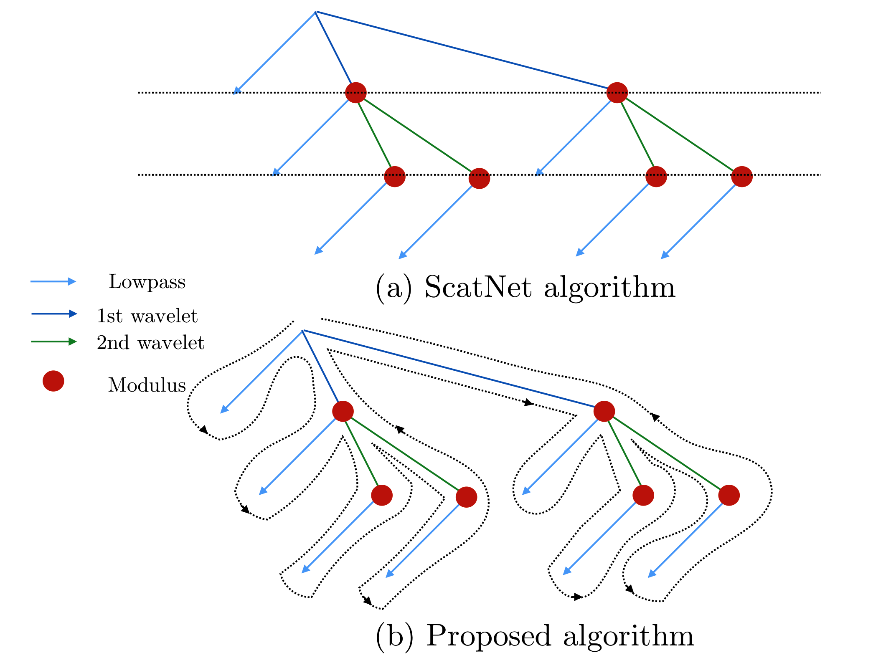

.. _user-guide:

User guide
**********

Introduction to scattering transforms
=====================================

A scattering transform is a non-linear signal representation that builds
invariance to geometric transformations while preserving a high degree of
discriminability. These transforms can be made invariant to translations,
rotations (for 2D or 3D signals), frequency shifting (for 1D signals), or
changes of scale. These transformations are often irrelevant to many
classification and regression tasks, so representing signals using their
scattering transform reduces unnecessary variability while capturing structure
needed for a given task. This reduced variability simplifies the building of
models, especially given small training sets.

The scattering transform is defined as a complex-valued convolutional neural
network whose filters are fixed to be wavelets and the non-linearity is a
complex modulus. Each layer is a wavelet transform, which separates the scales
of the incoming signal. The wavelet transform is contractive, and so is the
complex modulus, so the whole network is contractive. The result is a reduction
of variance and a stability to additive noise. The separation of scales by
wavelets also enables stability to deformation of the original signal. These
properties make the scattering transform well-suited for representing structured
signals such as natural images, textures, audio recordings, biomedical signals,
or molecular density functions.

Let us consider a set of wavelets :math:`\{\psi_\lambda\}_\lambda`, such that
there exists some :math:`\epsilon` satisfying:

.. math:: 1-\epsilon \leq \sum_\lambda |\hat \psi_\lambda(\omega)|^2 \leq 1

Given a signal :math:`x`, we define its scattering coefficient of order
:math:`k` corresponding to the sequence of frequencies
:math:`(\lambda_1,...,\lambda_k)` to be

.. math:: Sx[\lambda_1,...,\lambda_k] = |\psi_{\lambda_k} \star ...| \psi_{\lambda_1} \star x|...|

For a general treatment of the scattering transform, see
:cite:`mallat2012group`. More specific descriptions of the scattering transform
are found in :cite:`anden2014deep` for 1D, :cite:`bruna2013invariant` for 2D,
and :cite:`eickenberg2017solid` for 3D.

Practical implementation
========================

Previous implementations, such as ScatNet :cite:`anden2014scatnet`, of the
scattering transform relied on computing the scattering coefficients layer by
layer. In Kymatio, we instead traverse the scattering transform tree in a
depth-first fashion. This limits memory usage and makes the implementation
better suited for execution on a GPU. The difference between the two approaches
is illustrated in the figure below.

   The scattering tree traversal strategies of (a) the ScatNet toolbox, and (b)
   Kymatio. While ScatNet traverses the tree in a breadth-first fashion (layer
   by layer), Kymatio performs a depth-first traversal.

More details about our implementation can be found in :ref:`dev-guide`.

1-D
---

The 1D scattering coefficients computed by Kymatio are similar to those of
ScatNet :cite:`anden2014scatnet`, but do not coincide exactly. This is due to a
slightly different choice of filters, subsampling rules, and coefficient
selection criteria. The resulting coefficients, however, have a comparable
performance for classification and regression tasks.

2-D
---

The 2D implementation in this package provides scattering coefficients that
exactly match those of ScatNet :cite:`anden2014scatnet`.

3-D
---

The 3D scattering transform is currently limited to solid harmonic wavelets,
which are solid harmonics (spherical harmonics multiplied by a radial polynomial)
multiplied by Gaussians of different width.
They perform scale separation and feature extraction relevant to e.g. molecule structure
while remaining perfectly covariant to transformations with the Euclidean group.

The current implementation is very similar to the one used in :cite:`eickenberg2017solid`,
and while it doesn't correspond exactly, it makes use of better theory on sampling
and leads to similar performance on QM7.

Output size
===========

1-D
---

If the input :math:`x` is a Tensor of size :math:`(B, T)`, the output of the
1D scattering transform is of size :math:`(B, P, T/2^J)`, where :math:`P` is
the number of scattering coefficients and :math:`2^J` is the maximum scale of the
transform. The value of :math:`P` depends on the maximum order of the scattering
transform and the parameters :math:`Q` and :math:`J`. It is roughly proportional
to :math:`1 + J Q + J (J-1) Q / 2`.

2-D
---

Let us assume that :math:`x` is a tensor of size :math:`(B,C,N_1,N_2)`. Then the
output :math:`Sx` via a Scattering Transform with scale :math:`J` and :math:`L` angles and :math:`m` order 2 will have
size:

.. math:: (B,C,1+LJ+\frac{L^2J(J-1)}{2},\frac{N_1}{2^J},\frac{N_2}{2^J})

3-D
---

For an input array of shape $(B, C, N_1, N_2, N_3)$, a solid harmonic scattering with $J$
scales and $L$ angular frequencies, which applies $P$ different types of $\mathcal L_p$ 
spatial averaging, and $m$ order 2 will result in an output of shape

.. math:: (B, C, 1+J+\frac{J(J + 1)}{2}, 1+L, P)\,.

The current configuration of Solid Harmonic Scattering reflects the one in :cite:`eickenberg2017solid`
in that second order coefficients are obtained for the same angular frequency only
(as opposed to the cartesian product of all angular frequency pairs), at higher scale.

Frontends
=========

The Kymatio API is divided between different frontends, which perform the same operations, but integrate in different frameworks. This integration allows the user to take advantage of different features available in certain frameworks, such as autodifferentiation and GPU processing in PyTorch and TensorFlow/Keras, while having code that runs almost identically in NumPy or scikit-learn. The available frontends are:

* ``kymatio.numpy`` for NumPy,
* ``kymatio.sklearn`` for scikit-learn (as :class:`Transformer` and :class:`Estimator` objects),
* ``kymatio.torch`` for PyTorch,
* ``kymatio.tensorflow`` for TensorFlow, and
* ``kymatio.keras`` for Keras.

To instantiate a :class:`Scattering2D` object for the ``numpy`` frontend, run::

    from kymatio.numpy import Scattering2D
    S = Scattering2D(J=2, shape=(32, 32))

Alternatively, the object may be instantiated in a dynamic way using the :class:`kymatio.Scattering2D` object by providing a ``frontend`` argument. This object then transforms itself to the desired frontend. Using this approach, the above example becomes::

    from kymatio import Scattering2D
    S = Scattering2D(J=2, shape=(32, 32), frontend='numpy')

In Kymatio 0.2, the default frontend is ``torch`` for backwards compatibility reasons, but this change to ``numpy`` in the next version.

NumPy
-----

The NumPy frontend takes :class:`ndarray`\s as input and outputs :class:`ndarray`\s. All computation is done on the CPU, which means that it will be slow for large inputs. To call this frontend, run::

    from kymatio.numpy import Scattering2D

    scattering = Scattering2D(J=2, shape=(32, 32))

This will only use standard NumPy routines to calculate the scattering transform.

Scikit-learn
------------

For scikit-learn, we have the ``sklearn`` frontend, which is both a :class:`Transformer` and an :class:`Estimator`, making it easy to integrate the object into a scikit-learn :class:`Pipeline`. For example, you can write the following::

    from sklearn.pipeline import Pipeline
    from sklearn.linear_model import LogisticRegression

    from kymatio.sklearn import Scattering2D

    S = Scattering2D(J=1, shape=(8, 8))
    classifier = LogisticRegression()
    pipeline = Pipeline([('scatter', S), ('clf', classifier)])

which creates a :class:`Pipeline` consisting of a 2D scattering transform and a logistic regression estimator.

PyTorch
-------

If PyTorch is installed, we may also use the ``torch`` frontend, which is implemented as a :class:`torch.nn.Module`. As a result, it can be integrated with other PyTorch :class:`Module`\s to create a computational model. It also supports the :meth:`cuda`, :meth:`cpu`, and :meth:`to` methods, allowing the user to easily move the object from CPU to GPU and back. When initialized, a scattering transform object is stored on the CPU::

    from kymatio.torch import Scattering2D

    scattering = Scattering2D(J=2, shape=(32, 32))

We use this to compute scattering transforms of signals in CPU memory::

    import torch
    x = torch.randn(1, 1, 32, 32)

    Sx = scattering(x)

If a CUDA-enabled GPU is available, we may transfer the scattering transform
object to GPU memory by calling :meth:`cuda`::

    scattering.cuda()

Transferring the signal to GPU memory as well, we can then compute its
scattering coefficients::

    x_gpu = x.cuda()
    Sx_gpu = scattering(x)

Transferring the output back to CPU memory, we may then compare the outputs::

    Sx_gpu = Sx_gpu.cpu()
    print(torch.norm(Sx_gpu-Sx))

These coefficients should agree up to machine precision. We may transfer the
scattering transform object back to the CPU by calling :meth:`cpu`, like this::

    scattering.cpu()

.. _backend-story:

TensorFlow
----------

If TensorFlow is installed, you may use the ``tensorflow`` frontend, which is implemented as a :class:`tf.Module`. To call this frontend, run::

    from kymatio.tensorflow import Scattering2D
    scattering = Scattering2D(J=2, shape=(32, 32))

This is a TensorFlow module that one can use directly in eager mode. Like other modules (and like the ``torch`` frontend), you may transfer it onto and off the GPU using the :meth:`cuda` and :meth:`cpu` methods.

Keras
-----

For compatibility with the Keras framework, we also include a ``keras`` frontend, which wraps the TensorFlow class in a Keras :class:`Layer`, allowing us to include it in a :class:`Model` with relative ease. Note that since Keras infers the input shape of a :class:`Layer`, we do not specify the shape when creating the scattering object. The result may look something like::

    from tensorflow.keras.models import Model
    from tensorflow.keras.layers import Input, Flatten, Dense

    from kymatio.keras import Scattering2D

    in_layer = Input(shape=(28, 28))
    sc = Scattering2D(J=3)(in_layer)
    sc_flat = Flatten()(sc)
    out_layer = Dense(10, activation='softmax')(sc_flat)

    model = Model(in_layer, out_layer)

where we feed the scattering coefficients into a dense layer with ten outputs for handwritten digit classification on MNIST.

Backend
=======

The backends encapsulate the most computationally intensive part of the
scattering transform calculation. As a result, improved performance can
often be achieved by replacing the default backend with a more optimized
alternative.

For instance, the default backend of the ``torch`` frontend is the ``torch`` backend,
implemented exclusively in PyTorch. This is available for 1D, 2D, and 3D. It is also
compatible with the PyTorch automatic differentiation framework, and runs on
both CPU and GPU. If one wants additional improved performance on GPU, we
recommended to use the ``torch_skcuda`` backend.

Currently, two backends exist for ``torch``:

- ``torch``: A PyTorch-only implementation which is differentiable with respect
  to its inputs. However, it relies on general-purpose CUDA kernels for GPU
  computation which reduces performance.
- ``torch17``: Same as above, except it is compatible with the version <=1.7.1 of
  PyTorch.
- ``torch_skcuda``: An implementation using custom CUDA kernels (through ``cupy``) and
  ``scikit-cuda``. This implementation only runs on the GPU (that is, you must
  call :meth:`cuda` prior to applying it). Since it uses kernels optimized for
  the various steps of the scattering transform, it achieves better performance
  compared to the default ``torch`` backend (see benchmarks below). This
  improvement is currently small in 1D and 3D, but work is underway to further
  optimize this backend.
- ``torch17_skcuda``: Same as above, except it is compatible with the version <=1.7.1
  of PyTorch.

This backend can be specified via::

    import torch
    from kymatio.torch import Scattering2D

    scattering = Scattering2D(J=2, shape=(32, 32), backend='torch_skcuda')

Each of the other frontends currently only has a single backend, which is the
default. Work is currently underway, however, to extend some of these frontends
with more powerful backends.

Benchmarks
==========

1D
--

We compared our implementation with that of the ScatNet MATLAB package
:cite:`anden2014scatnet` with similar settings. The following table shows the
average computation time for a batch of size $64 \times 65536$. This
corresponds to $64$ signals containing $65536$, or a total of about
$95$ seconds of audio sampled at $44.1~\mathrm{kHz}$.

================================================================== ==========================
Name                                                               Average time per batch (s)
================================================================== ==========================
ScatNet :cite:`anden2014scatnet`                                   1.65
Kymatio (``torch`` frontend-backend, CPU)                          2.74
Kymatio (``torch`` frontend-backend, Quadro M4000 GPU)             0.81
Kymatio (``torch`` frontend-backend, V100 GPU)             0.15
Kymatio (``torch`` frontend, ``skcuda`` backend, Quadro M4000 GPU) 0.66
Kymatio (``torch`` frontend, ``skcuda`` backend, V100 GPU)         0.11
================================================================== ==========================

The CPU tests were performed on a 24-core machine. Further optimization of both
the ``torch`` and ``skcuda`` backends is currently underway, so we expect these
numbers to improve in the near future.

2D
--

We compared our implementation the ScatNetLight MATLAB package
:cite:`Oyallon_2015_CVPR` and a previous PyTorch implementation, *PyScatWave*
:cite:`8413168`. The following table shows the average computation time for a
batch of size $128 \times 3 \times 256 \times 256$. This corresponds to
$128$ three-channel (e.g., RGB) images of size $256 \times 256$.

============================================================   ==========================
Name                                                           Average time per batch (s)
============================================================   ==========================
MATLAB :cite:`Oyallon_2015_CVPR`                               >200
Kymatio (``torch`` frontend-backend, CPU)                      110
Kymatio (``torch`` frontend-backend, 1080Ti GPU)               4.4
Kymatio (``torch`` frontend-backend, V100 GPU)                 2.9
PyScatWave (1080Ti GPU)                                        0.5
Kymatio (``torch`` frontend, ``skcuda`` backend, 1080Ti GPU)   0.5
============================================================   ==========================

The CPU tests were performed on a 48-core machine.

3D
--

We compared our implementation for different backends with a batch size of $8 \times 128 \times 128 \times 128$.
This means that eight different volumes of size $128 \times 128 \times 128$ were processed at the same time. The resulting timings are:

===================================================================   ==========================
Name                                                                  Average time per batch (s)
===================================================================   ==========================
Kymatio (``torch`` frontend-backend, CPU)                             45
Kymatio (``torch`` frontend-backend, Quadro M4000 GPU)                7.5
Kymatio (``torch`` frontend-backend, V100 GPU)                        0.88
Kymatio (``torch`` frontend, ``skcuda`` backend, Quadro M4000 GPU)    6.4
Kymatio (``torch`` frontend, ``skcuda`` backend, V100 GPU)            0.74
===================================================================   ==========================

The CPU tests were performed on a 24-core machine. Further optimization of both
the ``torch`` and ``skcuda`` backends is currently underway, so we expect these
numbers to improve in the near future.

How to cite
===========

If you use this package, please cite the following paper:

Andreux M., Angles T., Exarchakis G., Leonarduzzi R., Rochette G., Thiry L., Zarka J., Mallat S., Andén J., Belilovsky E., Bruna J., Lostanlen V., Hirn M. J., Oyallon E., Zhang S., Cella C., Eickenberg M. (2019). Kymatio: Scattering Transforms in Python. arXiv preprint arXiv:1812.11214. `(paper) <https://arxiv.org/abs/1812.11214>`_

.. rubric:: References

.. bibliography:: _static/bibtex.bib

