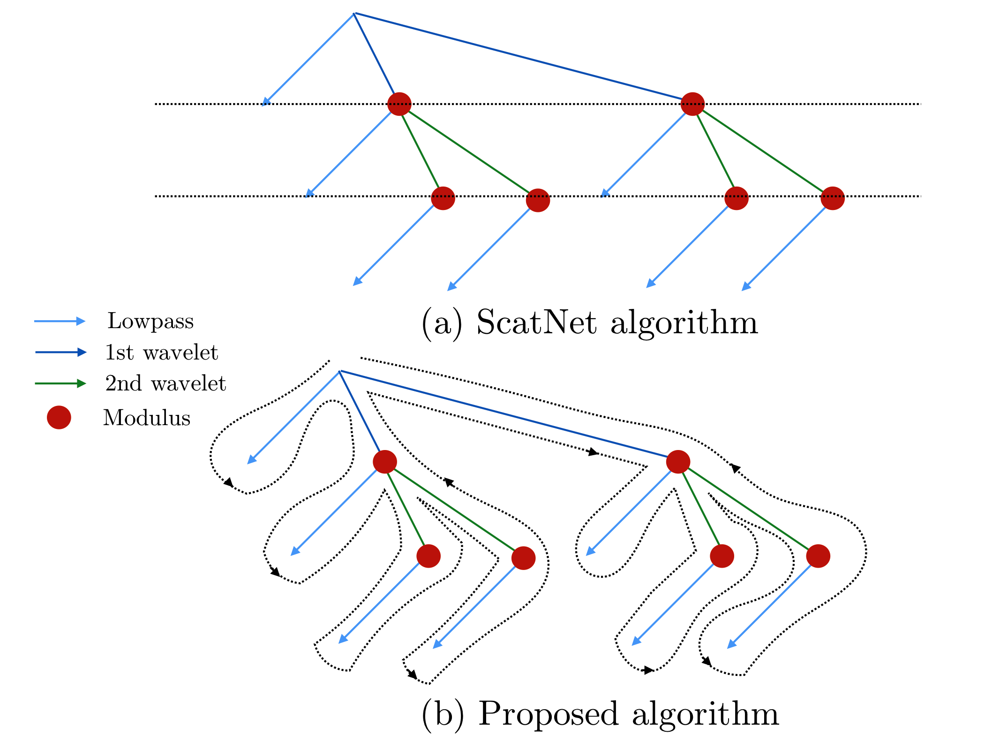

.. _user-guide:

User Guide
**********

Introduction to scattering transforms
=====================================

A scattering transform is a non-linear signal representation that builds
invariance to geometric transformations while preserving a high degree of
discriminability. These transforms can be made invariant to translations,
rotations (for 2D or 3D signals), frequency shifting (for 1D signals), or
changes of scale. These transformations are often irrelevant to many
classification and regression tasks, so representing signals using their
scattering transform reduces unnecessary variability while capturing structure
needed for a given task. This reduced variability simplifies the building of
models, especially given small training sets.

The scattering transform is defined as a complex-valued convolutional neural
network whose filters are fixed to be wavelets and the non-linearity is a
complex modulus. Each layer is a wavelet transform, which separates the scales
of the incoming signal. The wavelet transform is contractive, and so is the
complex modulus, so the whole network is contractive. The result is a reduction
of variance and a stability to additive noise. The separation of scales by
wavelets also enables stability to deformation of the original signal. These
properties make the scattering transform well-suited for representing structured
signals such as natural images, textures, audio recordings, biomedical signals,
or molecular density functions.

Let us consider a set of wavelets :math:`\{\psi_\lambda\}_\lambda`, such that
ther exists some :math:`\epsilon` satisfying:

.. math:: 1-\epsilon \leq \sum_\lambda |\hat \psi_\lambda(\omega)|^2 \leq 1

Given a signal :math:`x`, we define its scattering coefficient of order
:math:`k` corresponding to the sequence of frequencies
:math:`(\lambda_1,...,\lambda_k)` to be

.. math:: Sx[\lambda_1,...,\lambda_k] = |\psi_{\lambda_k} \star ...| \psi_{\lambda_1} \star x|...|

For a general treatment of the scattering transform, see
:cite:`mallat2012group`. More specific descriptions of the scattering transform
are found in :cite:`anden2014deep` for 1D, :cite:`bruna2013invariant` for 2D,
and :cite:`eickenberg2017solid` for 3D.

Practical implementation
========================

Previous implementations, such as ScatNet :cite:`anden2014scatnet`, of the
scattering transform relied on computing the scattering coefficients layer by
layer. In Kymatio, we instead traverse the scattering transform tree in a
depth-first fashion. This limits memory usage and makes the implementation
better suited for execution on a GPU. The difference between the two approaches
is illustrated in the figure below.

   The scattering tree traversal strategies of (a) the ScatNet toolbox, and (b)
   Kymatio. While ScatNet traverses the tree in a breadth-first fashion (layer
   by layer), Kymatio performs a depth-first traversal.

More details about our implementation can be found in :ref:`dev-guide`.

1-D
---

The 1D scattering coefficients computed by Kymatio are similar to those of
ScatNet :cite:`anden2014scatnet`, but do not coincide exactly. This is due to a
slightly different choice of filters, subsampling rules, and coefficient
selection criteria. The resulting coefficients, however, have a comparable
performance for classification and regression tasks.

2-D
---

The 2D implementation in this package provides scattering coefficients that
exactly match those of ScatNet :cite:`anden2014scatnet`.

3-D
---

Output size
===========

1-D
---

If the input :math:`x` is a Tensor of size :math:`(B, 1, T)`, the output of the
1D scattering transform is of size :math:`(B, P, T/2**J)`, where :math:`P` is
the number of scattering coefficients and `2**J` is the maximum scale of the
transform. The value of :math:`P` depends on the maximum order of the scattering
transform and the parameters :math:`Q` and :math:`J`. It is roughly proportional
to :math:`1 + J Q + J (J-1) Q / 2`.

2-D
---

Let us assume that :math:`x` is a tensor of size :math:`(B,C,N_1,N_2)`. Then, if the
output :math:`Sx` via a Scattering Transform with scale :math:`J` and :math:`L` angles will have
size:

.. math:: (B,C,1+LJ+\frac{L^2J(J-1)}{2},\frac{N_1}{2^J},\frac{N_2}{2^J})

3-D
---

Switching from CPU to GPU
=========================

When initialized, a scattering transform object is stored on the CPU::

    import torch
    from kymatio import Scattering2D

    scattering = Scattering2D(J=2, shape=(32, 32))

We use this to compute scattering transforms of signals in CPU memory::

    x = torch.randn(1, 1, 32, 32)
    Sx = scattering(x)

If a CUDA-enabled GPU is available, we may transfer the scattering transform
object to GPU memory by calling :meth:`cuda`::

    scattering.cuda()

Transferring the signal to GPU memory as well, we can then compute its
scattering coefficients::

    x_gpu = x.cuda()
    Sx_gpu = scattering(x)

Transferring the output back to CPU memory, we may then compare the outputs::

    Sx_gpu = Sx_gpu.cpu()
    print(torch.norm(Sx_gpu-Sx))

These coefficients should agree up to machine precision. We may transfer the
scattering transform object back to the CPU by calling::

    scattering.cpu()

.. _backend-story:

Backend
=======

The scattering transform implementation in Kymatio is structured around a
flexible backend framework. These backends encapsulate the most computationally
intensive part of the scattering transform calculation. As a result, improved
performance can often achieved by replacing the default backend with a more
optimized alternative.

The default backend in Kymatio, ``torch``, is implemented in PyTorch. This is
available for 1D, 2D, and 3D. It is also compatible with the PyTorch automatic
differentiation framework.

A more powerful backend, ``skcuda``, relies on ``scikit-cuda`` and ``cupy`` to
improve performance through optimized CUDA kernels. This backend is available
only in 1D and 2D. It is not differentiable and relies on additional
dependencies to work properly. These may be installed by running::

    pip install -r requirements_optional_cuda.txt

To specify which backend is to be used, you may edit the configuration file
found in ``~/.config/kymatio/kymatio.cfg``. To temporarily switch a backend, you
may use the ``KYMATIO_BACKEND`` environment variable, which overrides the
default setting in the configuration file. Alternatively, the backend may be
specified on a per-dimension basis through the ``KYMATIO_BACKEND_1D``,
``KYMATIO_BACKEND_2D``, and ``KYMATIO_BACKEND_3D`` variables.

1-D backend
-----------

Currently, two backends exist for the 1D scattering transform:

- ``torch``: A PyTorch-only implementation which is differentiable with respect
  to its inputs. However, it relies on general-purpose CUDA kernels for GPU
  computation which reduces performance.
- ``skcuda``: An implementation using custom CUDA kernels (through ``cupy``) and
  ``scikit-cuda``. This implementation only runs on the GPU (that is, you must
  call :meth:`cuda` prior to applying it) and is currently only slightly faster
  than the default ``torch`` backend. Work to further optimize this backend is
  currently underway.

2-D backend
-----------

Currently, two backends exist for the 2D scattering transform:

- ``torch``: A PyTorch-only implementation which is differentiable with respect
  to its inputs. However, it relies on general-purpose CUDA kernels for GPU
  computation which reduces performance.
- ``skcuda``: An implementation using custom CUDA kernels (through ``cupy``) and
  ``scikit-cuda``. This implementation only runs on the GPU (that is, you must
  call :meth:`cuda` prior to applying it). Since it uses kernels optimized for
  the various steps of the scattering transform, it achieves better performance
  compared to the default ``torch`` backend (see benchmarks below).

3-D backend
-----------

Currently, one backends exists for the 3D scattering transform:

- ``torch``: A PyTorch-only implementation which is differentiable with respect
  to its inputs. However, it relies on general-purpose CUDA kernels for GPU
  computation which reduces performance.

Benchmark with previous versions
================================

1-D backend
-----------

We compared our implementation with that of the ScatNet MATLAB package
:cite:`anden2014scatnet` with similar settings. The following table shows the
average computation time for a batch of size :math:`64 \times 1 \times 65536`:

==============================================    ==========================
Name                                              Average time per batch (s)
==============================================    ==========================
ScatNet :cite:`anden2014scatnet`                  1.65
Kymatio (``torch`` backend, CPU)                  2.74
Kymatio (``torch`` backend, Quadro M4000 GPU)     0.81
Kymatio (``torch`` backend, V100 GPU)             0.15
Kymatio (``skcuda`` backend, Quadro M4000 GPU)    0.66
Kymatio (``skcuda`` backend, V100 GPU)            0.11
==============================================    ==========================

The CPU tests were performed on a 24-core machine. Further optimization of both
the torch and skcuda backends is currently underway, so we expect these numbers
to improve in the near future.

2-D backend
-----------

We compared our implementation the ScatNetLight MATLAB package
:cite:`Oyallon_2015_CVPR` and a previous PyTorch implementation, *PyScatWave*
:cite:`8413168`. The following table shows the average computation time for a
batch of size :math:`128 \times 3 \times 256 \times 256`:

==============================================    ==========================
Name                                              Average time per batch (s)
==============================================    ==========================
MATLAB :cite:`Oyallon_2015_CVPR`                  >200
Kymatio (``torch`` backend, CPU)                  110
Kymatio (``torch`` backend, 1080Ti GPU)           4.4
Kymatio (``torch`` backend, V100 GPU)             2.9
PyScatWave (1080Ti GPU)                           0.5
Kymatio (``skcuda`` backend, 1080Ti GPU)          0.5
==============================================    ==========================

The CPU tests were performed on a 48-core machine.

3-D backend
-----------

.. rubric:: References

.. bibliography:: _static/bibtex.bib

